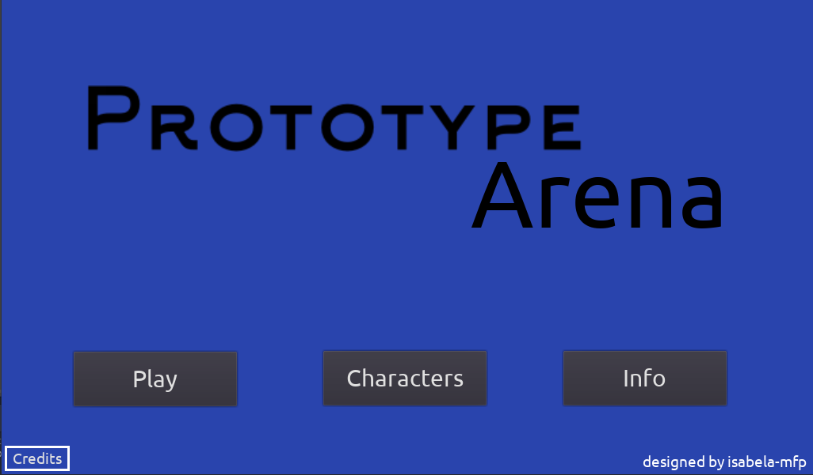

# Prototype Arena

### A simplified version of Summoners War for Artificial Intelligence research. Project for final paper (POC-I and POC-II) in Computer Science - UFMG



> Visuals will be developed slowly. Code is the focus!

### Tasks

The project is still under development and the next updates will focus on the following tasks:

- [x] Graphical Interface
- [x] Char Class
- [ ] Characters Class
- [ ] Accuracy functions
- [ ] Battle functions
- [ ] Deal with buffs
- [ ] Deal with debuffs
- [ ] Working Battle 

## 💻 Requirements

Before you start, make sure you have:

* The latest version of `<Godot Engine>`

## ☕ Using Prototype Arena

To use Prototype Arena, just open it in Godot.

```
This game wasn't exported to .exe yet
```

[⬆ Back to Top](#nome-do-projeto)<br>
